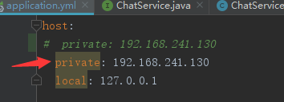
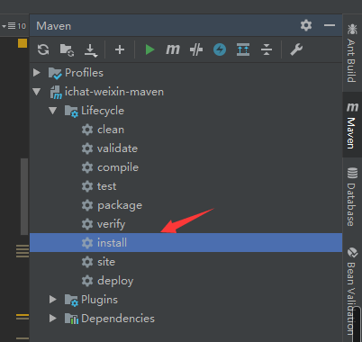

<h1><center>跨平台仿微信即时通讯聊天app</center></h1>

如果本项目对你有用，还请在项目右上角点个star，谢谢大佬支持。

# 作品简介

本项目采用前后端分离开发，面向restful风格的接口编程。

前端可跨平台在web，android，ios等设备上运行，图片服务器用的fastdfs统一管理app内图片，登录以及消息转发服务器采用netty+springboot，快速高效开发的同时，服务能承受大量在线同时进行聊天的后台，采用nginx进行反向转发代理，提高服务器稳定性。

采用docker容器方式部署，隔离开发与测试环境不一致问题。

# 涉及技术框架

后端：

- Netty
- SpringBoot
- Nginx+FastDFS分布式文件系统
- Mybatis
- lombok + slf4j
- swagger

后端项目：[传送门](https://github.com/DragonV96/ichat-server)

前端：

- MUI
- H5Plus（H5+）

前端项目：[传送门](https://github.com/DragonV96/ichat-weixin)

# 实现功能

- 用户的注册、登录与注销
- 用户离线推送消息
- 头像的上传与保存
- 修改昵称
- 好友申请与添加
- 心跳检测，断开长时间未活动的客户端，回收资源
- 聊天消息AES加密，防抓包,保障聊天消息安全性

# 环境参数

- 基础工具 maven3+、jdk8、tomcat8
- 开发工具 IDEA(或STS，或Eclipse，建议IDEA)
- 核心框架 SpringBoot2.0、Netty 4.1
- 持久层 MyBatis3.4.5
- 数据库 MariaDB/mysql HikariCP 2.7.9
- 文件服务器 nginx 1.12.0 fastdfs 5.05
- 前端框架 MUI H5plus
- 简化对象封装工具Lombok

# Windows搭建流程

1）可先执行下方一遍linux部署流程（可跳过）

2）项目导入idea（此操作若不会请百度）

3）将 `application.yml` 中的  private 值改为自己mysql服务器ip，mysql的password改为自己的密码。



4）搭建一个fastdfs（推荐使用docker搭建，搭建在centos7上），依次执行下述步骤

- 将项目下的 `script/deploy/fastdfs` 文件夹（fastdfs）通过Xftp工具（其他类似工具也可以）拷入到服务器任意位置

- 使用XShell（其他类似工具也可以）进入 `fastdfs` 的上层目录（执行 `ll` 命令能显示出 `fastdfs` 即可进入下一步）

  

- 依次执行下述5条命令（下方第四条命令的 `你的服务器IP` 替换为你的服务器本地IP，**如何查看本地IP请看linux部署流程 第七步**）

````
cp -r fastdfs /usr/local/

docker pull season/fastdfs

docker tag season/fastdfs:5.11 fastdfs-nginx:v5.11

sed -i -e "s|tracker_server=.*:22122|tracker_server=你的服务器IP:22122|g" /usr/local/fastdfs/conf/storage.conf

docker run --restart=always -m 512m -v /usr/local/fastdfs/storage:/data/fastdfs/storage -v /usr/local/fastdfs/tracker:/data/fastdfs/tracker -v /usr/local/fastdfs/conf/storage.conf:/etc/fdfs/storage.conf -v /usr/local/fastdfs/conf/tracker.conf:/etc/fdfs/tracker.conf -v /usr/local/fastdfs/conf/client.conf:/etc/fdfs/client.conf -v /usr/local/fastdfs/conf/mod_fastdfs.conf:/etc/fdfs/mod_fastdfs.conf --name fastdfs -d --net=host --privileged=true fastdfs-nginx:5.11
````

5）运行项目的 `Application.java` 文件启动。

# linux部署流程

**搭建前请确保自己有一个centos 7以上的服务器，且服务器已经提前装好docker，否则一键部署脚本会出错**

**配置文件无需自行修改ip，一键部署脚本中会涉及此操作**

1）修改项目中 `application.yml` 的数据库配置，如图

- `${host.private}` 改为 `${host.local}`
- password改为自己的密码


2）用maven执行install操作，打包项目。



3）将项目里的 `application.yml` `Dockerfile` 与打包好的 `jar包` 一起放入项目的 `script/deploy` 文件夹下。

4）将项目下的 `script/deploy` 文件夹通过Xftp工具（其他类似工具也可以）拷入到服务器任意位置

5）使用XShell（其他类似工具也可以）进入你拷进去的 `deploy` 文件夹下，执行

````
sudo chmod +x install_online.sh
sudo chmod +x delete.sh
sudo chmod +x restart.sh
````

6）然后执行安装命令

````
./install_online.sh
````

7）执行过程中会出现暂停，并且提示输入IP，此时输入服务器的本地IP即可（另起一个Xshell查看本机ip，命令如下，第二条显示的对应ip即为当前服务器ip）输入完成等待执行完毕即可。

````
ip addr
````


## 安装失败

执行删除所有容器及镜像脚本**（此操作会删除所有docker容器及镜像，若服务器存在其他容器及镜像请勿进行此操作）**

````
./delete.sh
````

## 重启容器

执行重启所有容器脚本

````
./restart.sh
````

# 界面展示


